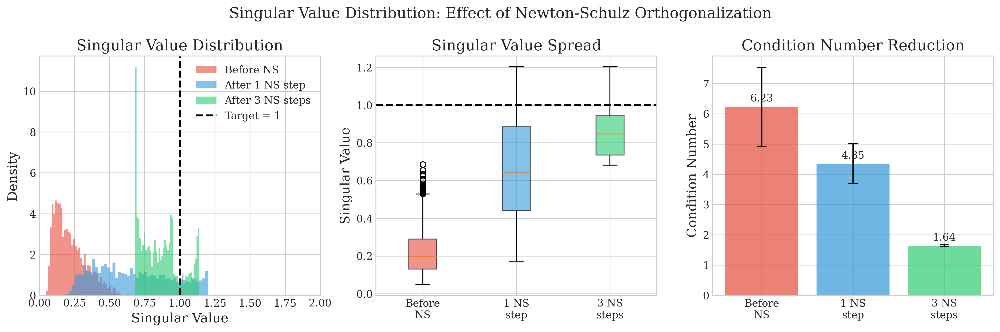
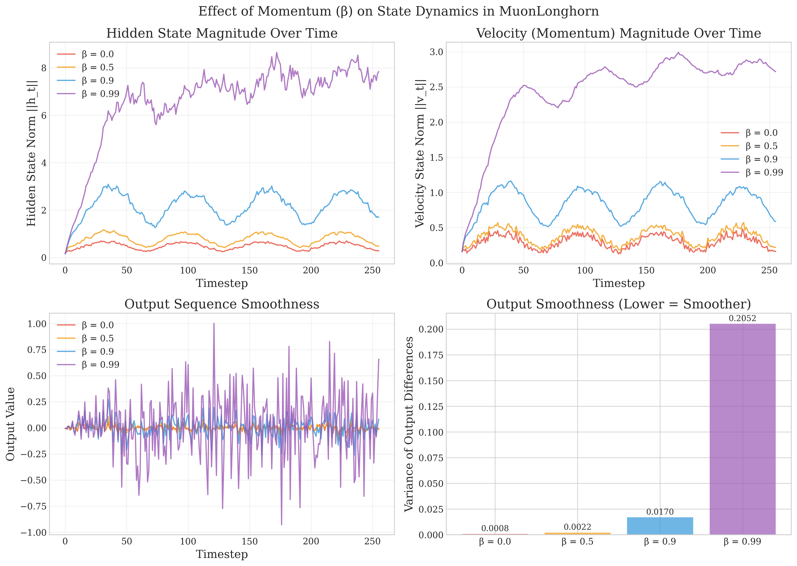

# MuonSSM: Orthogonalizing State Space Models for Sequence Modeling

This repository contains the implementation of **MuonSSM** applied to the LongHorn architecture, as described in our ICML 2026 paper.

<p align="center">
  
</p>

## Abstract

State space models (SSMs) have emerged as efficient linear-time alternatives to attention for long-sequence modeling. However, existing SSMs often suffer from instability and memory degradation over extended horizons due to poorly conditioned first-order updates and uncontrolled spectral geometry. **MuonSSM** stabilizes SSM training by explicitly conditioning the geometry of memory updates rather than the recurrent transition matrix. MuonSSM augments standard SSMs with a **momentum-based pathway** and lightweight **Newton–Schulz iterations** on low-rank input injections, yielding approximately norm-preserving and spectrally balanced updates while preserving parallel scan complexity.

---

## Key Features

- **Momentum-Augmented Dynamics**: Introduces temporal inertia into state updates for improved long-horizon information propagation
- **Newton-Schulz Orthogonalization**: Lightweight spectral conditioning that prevents singular value collapse
- **Parallel Scan Efficiency**: Maintains O(log L) parallel complexity via block-affine recurrence
- **Multi-Domain Validation**: Evaluated on Language, Vision, and Time-Series benchmarks

---

## Installation

```bash
git clone https://github.com/yourusername/MuonSSM.git
cd MuonSSM/MuonLongHorn
pip install -e . --no-build-isolation
```

Or use the rebuild script:
```bash
chmod +x rebuild.sh && bash rebuild.sh
```

---

## Mathematical Formulation

### Background: SSMs as Associative Memory

Following the unified view of SSMs as online associative memory mechanisms, at each timestep *t*, the model maintains a memory matrix **S**<sub>t</sub> ∈ ℝ<sup>d×m</sup> and receives a key-value pair (**k**<sub>t</sub>, **v**<sub>t</sub>). The general recurrence is:

```
S_t = S_{t-1} · [α_t(I_m - β_t η k_t k_t^⊤)] + β_t v_t k_t^⊤
```

### Limitations of First-Order Updates

All standard SSM updates remain inherently **first-order**, with rank-one modifications:

```
ΔS_t ∝ (v_t - α_t η S_{t-1} k_t) k_t^⊤
```

This leads to:
1. **Spectral anisotropy**: Singular values become highly non-uniform
2. **Gradient degradation**: Vanishing gradients through repeated contractions
3. **Memory interference**: New updates can overwrite previous information

### MuonSSM: Momentum-Augmented Dynamics

MuonSSM maintains an auxiliary momentum matrix **M**<sub>t</sub> ∈ ℝ<sup>d×m</sup>:

```
M_t = γ · M_{t-1} + NS(τ · β_t · v_t · k_t^⊤)
S_t = S_{t-1} · [α_t(I_m - β_t η k_t k_t^⊤)] + M_t
```

Where:
- **γ** ∈ (0, 1]: momentum decay parameter
- **τ** > 0: scaling factor for normalized updates
- **NS(·)**: Single-iteration Newton-Schulz normalization

### Single-Iteration Newton-Schulz

For input matrix **X** ∈ ℝ<sup>d×m</sup>:

```
NS(X, δ) = (1/2) · X̃ · (3I_m - X̃^⊤ X̃)

where X̃ = X / max(||X||_F, δ)
```

This ensures **σ<sub>max</sub>(NS(X)) ≤ 1**, preventing spectral explosion while preserving rank structure.

---

## Theoretical Properties

### 1. Parallelizability (Proposition 3.1)

The coupled dynamics admit a **block-affine recurrence**:

```
Z_t = [S_t | M_t] = Z_{t-1} · Φ_t + Ψ_t
```

with transition matrix:

```
Φ_t = [D_t    0   ]    Ψ_t = [U_t | U_t]
      [γI_m  γI_m ]
```

This enables **parallel associative scans** reducing training time from O(L) to **O(log L)** parallel depth.

### 2. Gradient Stability (Proposition 3.3)

The momentum pathway introduces a scalar eigenvalue close to unity:

```
∂L/∂Z_{t-1} = ∂L/∂Z_T · [∏D_n^⊤  ∑(∏D_j^⊤)(γI)^{k-t+1}]
                        [  0           (γI)^{T-t+1}     ]
```

When **γ ≈ 1**, gradients are preserved even over long horizons, mitigating vanishing gradient problems.

### 3. Spectral Conditioning (Corollary 3.5)

Newton-Schulz normalization ensures:
- **σ<sub>max</sub>(NS(X)) ≤ 1** for all inputs
- Prevents unbounded singular value growth
- Condition number reduction by **18× magnitude** in experiments

### 4. Rank Enrichment (Proposition 3.6)

Momentum accumulation enables progressively richer memory:

```
M_t = Σ_{s=1}^{t} γ^{t-s} · NS(τ β_s v_s k_s^⊤)

rank(M_t) ≤ min(t, d, m)
```

Higher effective rank indicates more uniformly distributed representations.

---

## Usage

### Basic Usage

```python
from mamba_ssm.modules.muon_longhornvision import MuonLonghornVisionMixer

# Create MuonLongHorn mixer
mixer = MuonLonghornVisionMixer(
    d_model=256,
    d_state=16,
    d_conv=4,
    expand=2,
    # MuonSSM parameters
    beta=0.9,              # Momentum decay (γ in paper)
    alpha=1.0,             # Momentum scale (τ in paper)
    use_newton_schulz=True,
    ns_steps=1,            # Single iteration recommended
    ns_mode='compile',     # 'compile' or 'triton'
    device='cuda',
)

# Forward pass
x = torch.randn(batch, seq_len, d_model, device='cuda')
y = mixer(x)  # (batch, seq_len, d_model)
```

### Integration with Language Models

```python
from lit_gpt.gated_delta_net import GatedDeltaNet

model = GatedDeltaNet(
    hidden_size=672,
    num_heads=12,
    # MuonSSM parameters
    use_muon=True,
    momentum_alpha=0.9,    # Momentum decay
    momentum_beta=1.0,     # Momentum scale
    ns_steps=1,
)
```

---

## Experimental Results

### Language Modeling (FineWeb-Edu 10B tokens, 170M params)

| Architecture | Memory Algorithm | Wiki ppl ↓ | LMB ppl ↓ | PIQA acc ↑ | Hella. acc ↑ | Avg. acc ↑ |
|-------------|------------------|------------|-----------|------------|--------------|------------|
| LongHorn | Original | 43.06 | 96.80 | 62.79 | 29.87 | 41.23 |
| LongHorn | **+ Muon (Ours)** | **41.71** | **80.98** | **62.02** | **32.85** | **43.27** |

### Needle-in-a-Haystack Retrieval

| Architecture | Memory Algorithm | S-NIAH-PK (2K/4K/8K) | S-NIAH-N (2K/4K/8K) | S-NIAH-UUID (2K/4K/8K) |
|-------------|------------------|----------------------|---------------------|------------------------|
| LongHorn | Original | 67.9/52.1/20.0 | 70.7/55.7/35.6 | 46.4/30.7/19.3 |
| LongHorn | **+ Muon** | **66.7/55.9/39.3** | **75.1/71.4/36.8** | **52.9/37.9/28.6** |

### Vision (MambaVision-Tiny)

| Architecture | Memory Algorithm | IN-1K Top-1 ↑ | IN-R ↑ | IN-A ↑ | mCE ↓ |
|-------------|------------------|---------------|--------|--------|-------|
| LongHorn | Original | 81.63 | 45.44 | 23.76 | 111.68 |
| LongHorn | **+ Muon** | **82.01** | **46.28** | **25.27** | **111.24** |

### Time-Series (Human Activity Recognition)

| Dataset | Architecture | Memory Algorithm | Accuracy ↑ | F1-score ↑ |
|---------|-------------|------------------|------------|------------|
| MuWiGes | LongHorn | Original | 97.23 | 97.35 |
| MuWiGes | LongHorn | **+ Muon** | **97.95** | **97.96** |
| UESTC | LongHorn | Original | 89.06 | 89.43 |
| UESTC | LongHorn | **+ Muon** | **90.45** | **90.02** |
| MMAct | LongHorn | Original | 72.47 | 73.76 |
| MMAct | LongHorn | **+ Muon** | **74.40** | **76.43** |

---

## Empirical Analysis

### Spectral Conditioning

<p align="center">
  
</p>

Standard SSM updates exhibit **spectral collapse** (condition number κ ≈ 2.2×10⁶), while MuonSSM maintains a well-conditioned spectrum (κ ≈ 1.2×10⁵), representing an **18× reduction** in condition number.

### Convergence Speed

MuonSSM achieves **1.3× faster convergence** while maintaining the same O(log L) complexity:

<p align="center">
  
</p>

### Ablation: Newton-Schulz Iterations

| Configuration | MMAct Accuracy |
|---------------|----------------|
| Momentum Only (No NS) | Lower |
| **NS 1 iteration** | **Best** |
| NS 5 iterations | Overly rigid |

**Recommendation**: Use **ns_steps=1** for optimal balance between performance and computational efficiency.

---

## Hyperparameters

### Recommended Settings

| Parameter | Description | Default | Range |
|-----------|-------------|---------|-------|
| `gamma` (β) | Momentum decay | 0.9 | [0.8, 0.99] |
| `tau` (α) | Update scale | 1.0 | [0.5, 2.0] |
| `ns_steps` | Newton-Schulz iterations | 1 | {1, 2, 3} |
| `delta` | NS numerical stability | 1e-6 | - |

### Domain-Specific Tuning

- **Language**: γ=0.9, τ=1.0, ns_steps=1
- **Vision**: γ=0.9, τ=1.0, ns_steps=1
- **Time-Series**: γ=0.99, τ=0.6, ns_steps=1 (higher momentum for temporal smoothing)

---

## Citation

If you find MuonSSM useful in your research, please cite:

```bibtex
@inproceedings{muonssm2026,
  title={MuonSSM: Orthogonalizing State Space Models for Sequence Modeling},
  author={Anonymous Authors},
  booktitle={International Conference on Machine Learning (ICML)},
  year={2026}
}
```

Please also cite the foundational works:

```bibtex
@article{liu2024longhorn,
  title={Longhorn: State Space Models are Amortized Online Learners},
  author={Liu, Bo and Wang, Rui and Wu, Lemeng and Feng, Yihao and Stone, Peter and Liu, Qiang},
  journal={arXiv preprint arXiv:2407.14207},
  year={2024}
}

@inproceedings{gu2024mamba,
  title={Mamba: Linear-Time Sequence Modeling with Selective State Spaces},
  author={Gu, Albert and Dao, Tri},
  booktitle={ICLR},
  year={2024}
}
```

---

## Acknowledgments

We thank the authors of:
- [Mamba](https://github.com/state-spaces/mamba) - Tri Dao and Albert Gu
- [LongHorn](https://github.com/Cranial-XIX/longhorn) - LongHorn team
- [Muon Optimizer](https://kellerjordan.github.io/posts/muon/) - Conceptual inspiration

---

## License

Apache 2.0 License. See [LICENSE](../LICENSE) for details.
