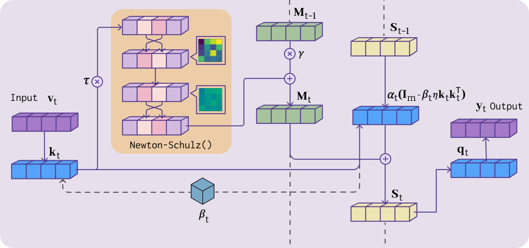

# MuonSSM: Orthogonalizing State Space Models for Sequence Modeling

<p align="center">
  
</p>

**MuonSSM** introduces **Momentum** and **Newton-Schulz Orthogonalization** into State Space Models (SSMs) to achieve enhanced stability, faster convergence, and improved performance across diverse sequence modeling tasks.

---

## Table of Contents

- [Installation](#installation)
- [Methodology](#methodology)
- [Project Structure](#project-structure)
- [Evaluation Tasks](#evaluation-tasks)
- [Usage](#usage)
- [Acknowledgments](#acknowledgments)

---

## Installation

### Prerequisites

- Python ≥ 3.9
- PyTorch ≥ 2.0.0
- CUDA ≥ 11.8
- Triton

### Install from Source

```bash
# Clone the repository
git clone https://github.com/t-khanusa/MuonSSM.git
cd MuonSSM

# Install MuonMamba
cd MuonMamba
pip install -e . --no-build-isolation

# Install MuonLongHorn
cd ../MuonLongHorn
pip install -e . --no-build-isolation

# Install MuonGatedDeltaNet dependencies
cd ../MuonGatedDeltaNet
pip install -r requirements.txt
```

---

## Methodology

### Background: SSMs as Associative Memory

Following the unified view of SSMs as online associative memory mechanisms, at each timestep *t*, the model maintains a memory matrix **S**<sub>t</sub> ∈ ℝ<sup>d×m</sup>. The general recurrence is:

```
S_t = S_{t-1} · [α_t(I_m - β_t η k_t k_t^⊤)] + β_t v_t k_t^⊤
```

Recent SSM variants (Mamba, DeltaNet, Gated DeltaNet, LongHorn) primarily differ in their choices of scalar gates α<sub>t</sub>, β<sub>t</sub>, and η.

### Limitations of First-Order Updates

All standard SSM updates remain **first-order** with rank-one modifications, leading to:
1. **Spectral anisotropy**: Singular values become highly non-uniform
2. **Gradient degradation**: Vanishing gradients through repeated contractions
3. **Memory interference**: New updates overwrite previous information

### MuonSSM: Momentum-Augmented Dynamics

MuonSSM maintains an auxiliary momentum matrix **M**<sub>t</sub>:

```
M_t = γ · M_{t-1} + NS(τ · β_t · v_t · k_t^⊤)      [Momentum Update]
S_t = S_{t-1} · D_t + M_t                          [State Update]
```

Where:
- **γ** ∈ (0, 1]: momentum decay parameter
- **τ** > 0: scaling factor for normalized updates
- **NS(·)**: Single-iteration Newton-Schulz normalization

### Single-Iteration Newton-Schulz

```
NS(X, δ) = (1/2) · X̃ · (3I_m - X̃^⊤ X̃)
where X̃ = X / max(||X||_F, δ)
```

This ensures **σ<sub>max</sub>(NS(X)) ≤ 1**, preventing spectral explosion.

---

## Project Structure

```
MuonSSM/
├── README.md                     # This file
├── LICENSE                       # Apache 2.0 License
├── .gitignore
├── assets/
│
├── MuonMamba/                    # MuonMamba implementation
│   ├── mamba_ssm/
│   │   ├── modules/
│   │   │   ├── muon_mambavision.py   # Vision mixer
│   │   │   └── muonmamba.py
│   │   ├── ops/
│   │   │   └── triton/newton_schulz.py
│   │   └── models/
│   ├── csrc/                     # CUDA kernels
│   └── setup.py
│
├── MuonLongHorn/                 # MuonLongHorn implementation
│   ├── mamba_ssm/
│   │   ├── modules/
│   │   │   └── muon_longhornvision.py
            └── longhorn.py
│   │   └── ops/
│   ├── csrc/                     # CUDA kernels
│   ├── figures/                  # Analysis figures
│   └── setup.py
│
└── MuonGatedDeltaNet/            # MuonGatedDeltaNet for language
    ├── lit_gpt/
    │   ├── gated_delta_net.py    # GatedDeltaNet with Muon
    │   ├── model.py
    │   └── config.py
    ├── pretrain.py
    └── scripts/
```

---

## Evaluation Tasks

### 1. Language Modeling and Long-Context Retrieval

We evaluate on common-sense reasoning benchmarks and long-context retrieval tasks.

```bash
cd MuonGatedDeltaNet

python pretrain.py \
    --train_data_dir ${TRAIN_DATA} \
    --val_data_dir ${VALIDATION_DATA} \
    --output_root ${SAVE_DIR} \
    --exp_name muon_gated_deltanet \
    --model_name GatedDeltaNet_120M \
    --learning_rate 1e-3 \
    --micro_batch_size 8
```

**Model Configuration (170M params):**
| Parameter | Value |
|-----------|-------|
| Layers | 10 |
| Heads | 12 |
| Model Dimension | 672 |
| Context Length | 4096 |

### 2. Vision Spartial Modeling and Robustness

Drop-in replacement for spatial SSM mixers in hierarchical vision architectures.

```python
from mamba_ssm.modules.muon_mambavision import MuonMambaVisionMixer

mixer = MuonMambaVisionMixer(
    d_model=256,
    d_state=16,
    beta=0.9,
    alpha=1.0,
    use_newton_schulz=True,
    ns_steps=1,
    device='cuda',
)
```

**Evaluated on:**
- ImageNet-1K (Classification)
- MS COCO (Object Detection, Instance Segmentation)
- ADE20K (Semantic Segmentation)
- Robustness: IN-C, IN-R, IN-A

### 3. Time-Series for Human Activity Recognition

```bash
cd MuonGatedDeltaNet

python training_MuWiGes.py \
    --name MMA \
    --d_model 128 \
    --d_state 64 \
    --num_classes 12 \
    --momentum_beta 0.99 \
    --momentum_alpha 0.6
```

**Datasets:**
- MuWiGes (12 hand gestures)
- UESTC-MMEA-CL (32 daily activities)
- MMAct (37 complex actions)

---

## Usage

### Basic MuonSSM Usage

```python
import torch
from mamba_ssm.modules.muon_longhornvision import MuonLonghornVisionMixer

# Create mixer with MuonSSM
mixer = MuonLonghornVisionMixer(
    d_model=256,
    d_state=16,
    # MuonSSM parameters
    beta=0.9,              # Momentum decay (γ in paper)
    alpha=1.0,             # Momentum scale (τ in paper)
    use_newton_schulz=True,
    ns_steps=1,            # Single iteration recommended
    device='cuda',
)

# Forward pass
x = torch.randn(batch, seq_len, d_model, device='cuda')
y = mixer(x)
```

### Hyperparameter Recommendations

| Parameter | Description | Default | Notes |
|-----------|-------------|---------|-------|
| `gamma` (β) | Momentum decay | 0.9 | Higher for time-series (0.99) |
| `tau` (α) | Update scale | 1.0 | Lower for time-series (0.6) |
| `ns_steps` | NS iterations | 1 | 1 is optimal for most cases |
| `delta` | Numerical stability | 1e-6 | Fixed |

---

## Acknowledgments

We thank the authors of:
- [Mamba](https://github.com/state-spaces/mamba) - Tri Dao and Albert Gu
- [GatedDeltaNet](https://github.com/NVlabs/GatedDeltaNet) - NVIDIA Research
- [LongHorn](https://github.com/Cranial-XIX/longhorn) - LongHorn team
- [MambaVision](https://github.com/NVlabs/MambaVision) - NVIDIA Research
- [Muon Optimizer](https://kellerjordan.github.io/posts/muon/) - Conceptual inspiration
- [Flash Linear Attention](https://github.com/fla-org/flash-linear-attention) - FLA team

---

## License

This project is licensed under the Apache 2.0 License - see the [LICENSE](LICENSE) file for details.

---

## Contact

For questions or issues, please open a GitHub issue.
